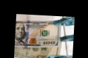
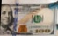
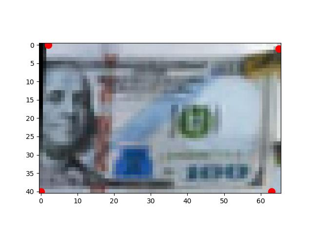

# Manual Pre-Processing Image for Counterfeit Bill Detection
This project manually extracts and pre-processes bills from an image to be prepared for counterfeit detection.
## Original Image

## 1. Extract Front-Facing Bill
## 1.1 Rotate Image
```
banknote = cv2.imread('banknote.jpg', 1)
rows, cols, _ = banknote.shape
center = (rows // 2, cols // 2)
frotation_matrix = cv2.getRotationMatrix2D(center, -93, 1.0)
frotated_bill = cv2.warpAffine(banknote, frotation_matrix, (cols, rows))
```
<br>
Rotate image -93 degrees to straighten front-facing bill
## 1.2 Crop Image
```
front_bill = frotated_bill[26:67, 21:87]
```

## Fix Shear in Bill
```
pts1 = np.float32([[2, 0], [65, 1], [0, 40], [63, 40]])
pts2 = np.float32([[0, 0], [66, 0], [0, 41], [66, 41]])
plt.imshow(front_bill)
plt.scatter(pts1[:, 0], pts1[:, 1], color='red', s=100)
plt.show()
```

Create a plot to find coordinates of corners
```
M = cv2.getPerspectiveTransform(pts1, pts2)
frontfacing_bill = cv2.warpPerspective(front_bill, M, (66, 41))
cv2.imshow('Front-Facing Bill', frontfacing_bill)
```

Warp image to remove shear
